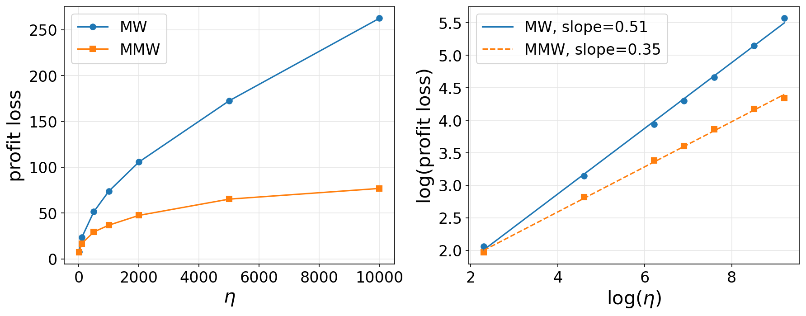

# Two-Sided Queue Erratum — Numerical Simulations

Reproduces **Figure 1** of the erratum to

> S. M. Varma, P. Bumpensanti, S. T. Maguluri, H. Wang.
> *Dynamic Pricing and Matching for Two-Sided Queues.*
> Operations Research 71(1):83–100, 2023. ([arXiv:1911.02213](https://arxiv.org/abs/1911.02213))

The experiment compares the **profit loss** of the two-price pricing policy combined with

* the **max-weight (MW)** matching policy, and
* the **modified max-weight (MMW)** matching policy

on a 2×2 two-sided queue whose compatibility graph does **not** satisfy the CRP
condition. The point of the erratum is that on such graphs the original Theorem 2
may fail under MW but continues to hold under MMW: the profit loss scales as
Θ(√η) for MW versus Θ(η^{1/3}) for MMW.

## Results

Simulated profit loss `L^η`, averaged over 3 independent seeds (mean ± std;
100M uniformized slots per seed, 15M burn-in):

| η      |            MW |          MMW |
|-------:|--------------:|-------------:|
| 10     |   7.84 ± 0.01 |  7.16 ± 0.02 |
| 100    |  23.29 ± 0.06 | 16.79 ± 0.02 |
| 500    |  51.44 ± 0.24 | 29.41 ± 0.27 |
| 1000   |  73.87 ± 0.81 | 36.81 ± 1.11 |
| 2000   | 105.69 ± 2.10 | 47.47 ± 2.56 |
| 5000   | 172.45 ± 6.27 | 65.21 ± 6.01 |
| 10000  | 262.49 ± 12.3 | 76.87 ± 9.68 |

Least-squares slopes of `log L^η` vs `log η` (on the seed-averaged means):

| policy | fitted slope | theory |
|--------|:-----------:|:------:|
| MW     | **0.51**     | 1/2    |
| MMW    | **0.35**     | 1/3    |



## Model

* Continuous-time MDP simulated via **uniformization** (constant `c = 4η`): in each
  discrete slot there is at most one arrival — a type-`j` customer with probability
  `λ_j(q)/c`, a type-`i` server with probability `μ_i(q)/c`, otherwise idle.
* Compatibility graph `E = {(1,1),(1,2),(2,2)}` (edges written `(server i, customer j)`):
  server 1 serves customers 1 and 2, server 2 serves only customer 2.
* Demand curves `F₁(λ)=5−λ`, `F₂(λ)=4−λ`; supply curves `G₁(μ)=1.5μ`, `G₂(μ)=μ`.
  These are designed so each diagonal link is marginally balanced
  (`MR₁=MC₁=3`, `MR₂=MC₂=2`). The redundant edge `(1,2)` joins the expensive server 1
  (`MC=3`) to the low-value customer 2 (`MR=2`), so `χ*₁₂=0`, `E_r={(1,2)}`.
* Fluid solution: `λ*=μ*=(1,1)`, `χ*` diagonal — the unique fluid optimum (value 4.5),
  confirmed by `verify_fluid()`.
* **Two-price policy** (τ_max = 0, σ = η^{2/3} n^{-1/3}, θ = φ = 1): the arrival rate
  is `ηλ*_j` while the corresponding queue is empty and `ηλ*_j − θ_j σ` once it is
  positive (symmetrically for servers).
* **Profit loss** (paper Definition 4):
  `L^η = η·π* − E[revenue rate] + s·E[Σ q]`, with holding cost `s = 1` and
  `π* = ⟨F(λ*),λ*⟩ − ⟨G(μ*),μ*⟩ = 4.5`. Because the pricing rates are a deterministic
  function of the (random) queue state, the per-slot revenue reduction relative to
  `η·π*` is accumulated directly, which avoids catastrophic cancellation and keeps the
  Monte-Carlo variance low.

## Usage

```bash
pip install -r requirements.txt

# full run: 3 seeds averaged per configuration (~2 min with numba)
# writes results.json (mean, std, per-seed) and the three figures
python simulate_erratum.py

# change the number of seeds averaged (default 3)
python simulate_erratum.py --seeds 5

# fast smoke test (slopes are noisier)
python simulate_erratum.py --quick

# re-draw the figures from a previously saved results.json (no simulation)
python simulate_erratum.py --plot-only

# custom accuracy / output location
python simulate_erratum.py --steps 200000000 --burn 30000000 --out-dir figures
```

### Outputs

| file                          | description                                   |
|-------------------------------|-----------------------------------------------|
| `mw_vs_mmw.eps`               | linear panel (profit loss vs η)               |
| `log_log_mw_vs_mmw_eta.eps`   | log-log panel with fitted slopes              |
| `mw_vs_mmw.png`               | combined two-panel preview                     |
| `results.json`                | mean / std / per-seed losses (for `--plot-only`) |

The two `.eps` filenames match those referenced by the erratum's LaTeX source.

## Notes

* [`numba`](https://numba.pydata.org/) JIT-compiles the inner simulation loop; without
  it the code still runs (pure-Python fallback) but is ~50× slower.
* Each configuration is run with `--seeds` independent seeds (default 3) and the mean is
  reported; `results.json` also stores the per-seed values and standard deviation. Runs
  are deterministic for a fixed number of steps and seeds.
* `θ` and `φ` (the two-price rate-reduction constants) are not specified in the erratum;
  they are set to 1. They affect only the constant, not the scaling exponents.
